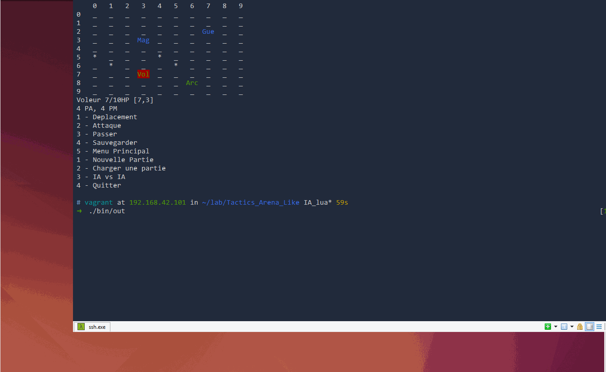
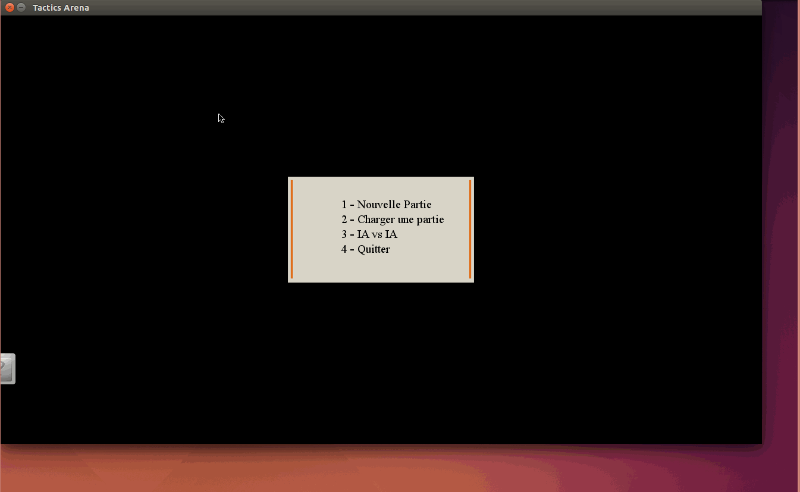

Tactics Arena Like  [](https://travis-ci.org/Drakirus/Tactics_Arena_Like/branches)
==

Notre projet, qui se déroule dans le cadre de notre premier semestre de deuxième année de licence SPI, a pour but de nous faire programmer en langage C une version, fonctionnelle sur la console et qui nous est propre, de ce jeu. Notre trinôme se compose de **Champion Pierre, Laville Martin et Mok Modira**.

# Release - 1.0 

https://github.com/Drakirus/Tactics_Arena_Like/releases

# Release - 1.2 "lua"

https://github.com/Drakirus/Tactics_Arena_Like/raw/IA_lua/terminal.zip

# Release - 2.0 "SDL"

## Source 
lien Sprites : http://www.inet2inet.com/InetSoftware/Free_Char_Anims.asp

## Instructions de compilation

### EasySDL
EasySDL est nécessaire à la compilation 
Instruction : https://github.com/DanAurea/EasySDL

Exemple :


### lua est nécessaire à la compilation 
l'api Lua exemple :



```
$ make lua
```
pour les plateformes diférentes de linux :
```
$ make lua plat="platforms supported"
```
> **platforms supported** aix bsd c89 freebsd generic linux macosx mingw posix solaris

### Jeux
Pour compiler l'ensemble des sources :
```
$ make
```
 L'exécutable généré peut être retrouvé dans **./bin**

Pour exécuter le programme :

```
$ ./bin/out
```
### Documentation
```
$ make doc
```
La documentation  générée peut être retrouvée dans **./doc/html/index.html**
### Nettoyage
```
$ make clean
```
Supprime les fichiers dus à la création de l'exécutable
```
$ make rmdoc
```
Supprime les fichiers de la documentation
```
$ make lua-rm
```
Supprime les fichiers de la lib LUA
```
$ make mrproper
```
Retour à état du répertoire avant action de l'utilisateur
   


### Lien Github


https://github.com/Drakirus/Tactics_Arena_Like
